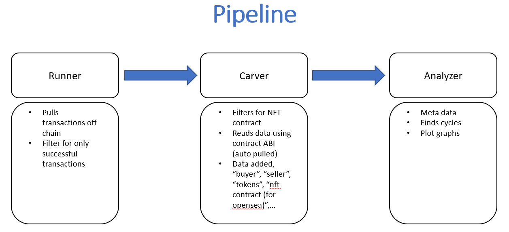
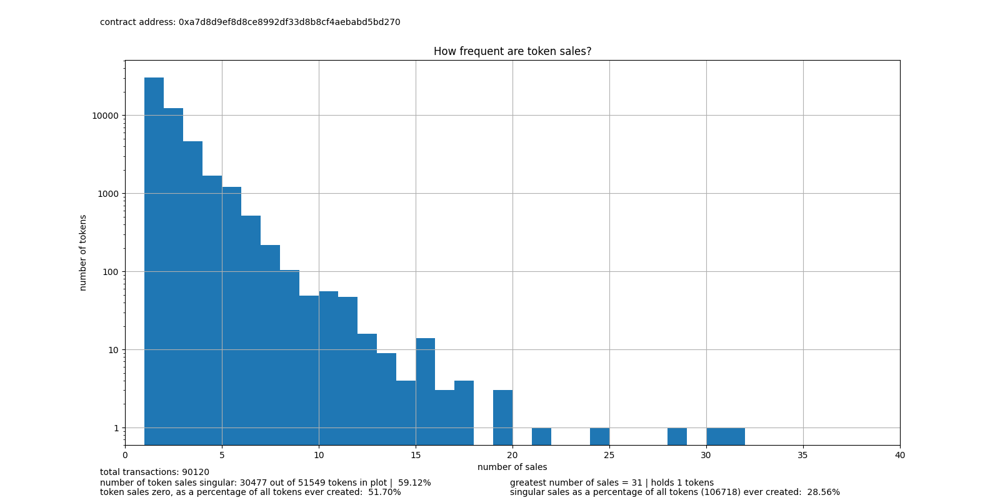
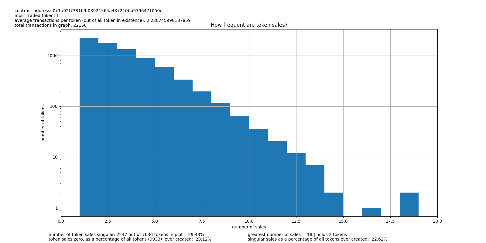

# NFT contract Measurement Tool
------------
## Description

A tool used to gather information on Non-Fungible Token trading within the Ethereum Network.

------------------
## Design
The tool consists of three *modules*, the modules connect creating a *pipeline*. Each module outputs a file<a name="footnote1">1</a>
which is feed into the following module. 


<sup>[1](#footnote1) reading and writting to files is time consuming, but allows a degree of freedom when testing individual modules and collecting different data</sup>


[runner.py](https://github.com/nateRot/NFT-Contract-Measurement-Tool/blob/main/runner.py) - pulls all data transactions from an Ethereum node (used local node in example). Filters for only transactions that succeeded.

Outputs a file `data/{contract name}_{start block}_{end block}.csv`

[eth_carver.py](https://github.com/nateRot/NFT-Contract-Measurement-Tool/blob/main/eth_carver.py) - reads runner ouput file. Extracts on relevant NFT transactions but function call (atomicMatch_).  
Pulls contract ABI used to read function data.  
Adds columns to csv file with more data interpreted with the ABI  

Outputs a file  `data/clean_{contract name}.csv`

[data_analysis.py](https://github.com/nateRot/NFT-Contract-Measurement-Tool/blob/main/data_analysis.py) - reads carver output file. Collects meta data into `"data/meta_data.txt"`. Creates histograms `nft_plots/{contract address}_bin.png`. Outputs cycles in `dirty_wallets.txt`.

-------------
## Usage
Under [complete_pipeline_execution.py](https://github.com/nateRot/NFT-Contract-Measurement-Tool/blob/main/complete_pipeline_execution.py) change following fields to desired blocks, contract name (can remain blank), and contract address:  
`START_BLOCK`=12536766  
`END_BLOCK`=13361368  

`contract_name` = 'opensea'  
`contract_address` = '0x7Be8076f4EA4A4AD08075C2508e481d6C946D12b'.lower()

Run file for full pipeline

---------------
## Pipeline Output

**meta_data.txt** 
```text
blocks: 12536769 (date 30-05-2021 | time 18:21:07) -> 13361368 (date 05-10-2021 | time 23:08:44)
total transactions: 4405321
number of unique nft contracts: 4661
number of unique wallets: 429682
------------------------------------------------------------------------------------------------------------
nft contract rankings:
top 1 transactions: 1061817 - 0x495f947276749ce646f68ac8c248420045cb7b5e
top 2 transactions: 91229 - 0xa7d8d9ef8d8ce8992df33d8b8cf4aebabd5bd270
top 3 transactions: 46249 - 0x76be3b62873462d2142405439777e971754e8e77
...

low 30 transactions: 1 - 0xac0f37b94750e84a40c0e3e97a1714703c3dba0b

average number of transactions per contract: 601.0423820908499
------------------------------------------------------------------------------------------------------------
total ether spent in contracts: 2363751.30764486
average ether spent on a nft: 0.5378757152565157

most expensive purcahses:
2275.0 - 0x7b459405ae0a5538f26be77fb42b67f363a8bea660e1f0ce2042cf8fc6da4fbf
2100.0 - 0x1b9c6bce926cd54c084e245b15156ecd3bc42eec273c08f2a1c73c661b09b9d5
1800.0 - 0x71301ecceb449b3d15f1aea9dbd5f64917a2c3874337e305e6e5cb692914b843
```
  
**{art blocks}_bin.png**  
  

**{cool cats}_bin.png**
  

